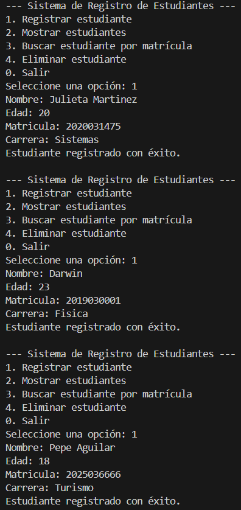
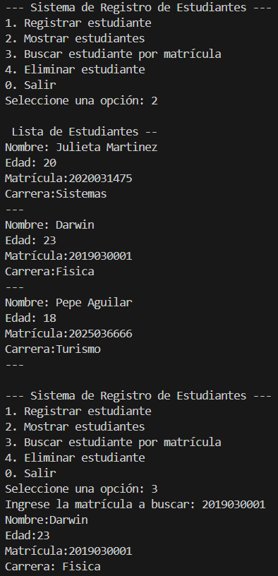

# SistemaRegistrosEstudiantes
### Descripción del Proyecto

Este proyecto es un sistema de registro de estudiantes desarrollado en Java. Permite gestionar una lista de estudiantes utilizando estructuras de control básicas y la clase Scanner para la entrada de datos. Además, se integra con GitHub para el control de versiones y la colaboración en equipo.

### Implementación del Proyecto
El proyecto "Sistema de Registro de Estudiantes en Java" se desarrolló utilizando el lenguaje de programación Java. Se implementó un programa basado en consola que permite gestionar una lista de estudiantes mediante opciones de menú. El desarrollo se realizó siguiendo estos pasos:

1. Estructura del Código: Se definieron clases y métodos para manejar la información de los estudiantes.
2. Entrada y Salida de Datos: Se utilizó la clase Scanner para recibir información del usuario.
3. Gestión de Estudiantes: Se empleó una lista para almacenar los registros, permitiendo operaciones como agregar, buscar y eliminar estudiantes.
4. Interfaz por Consola: Se creó un menú interactivo con switch-case para que el usuario pueda seleccionar las opciones disponibles.
5. Control de Versiones: Se usó Git y GitHub para gestionar el código y permitir la colaboración en equipo.

### Funcionalidades:
- Registrar nuevos estudiantes con su nombre, edad, matrícula y carrera.
- Mostrar la lista de estudiantes registrados.
- Buscar un estudiante por matrícula.
- Eliminar un estudiante de la lista.
- Salir del programa.

### Instrucciones para Compilar y Ejecutar el Programa
Requisitos Previos:
1. Tener instalado Java Development Kit (JDK) 8 o superior.
2. Un IDE compatible con Java (IntelliJ IDEA, Eclipse, NetBeans) o terminal con javac.
3. Conocimientos básicos de Git y GitHub para la gestión del repositorio.

### Pasos para Compilar y Ejecutar:
1. Clonar el repositorio desde GitHub:
> git clone https://github.com/Nnncyyy/SistemaRegistrosEstudiantes.git

2. Acceder a la carpeta del proyecto:
> cd SistemaRegistroEsrtudiante

3. Compilar el código fuente:
> javac SistemaRegistroEsrtudiante.java

4. Ejecutar el programa:
> java SistemaRegistroEsrtudiante

### Capturas de Pantalla del Programa en Funcionamiento

#### Caso de uso 1: Registrar estudiante  
Objetivo: Registrar un nuevo estudiante en el sistema.

Flujo de acciones:
1. El usuario selecciona la opción 1 (Registrar estudiante).
2. Ingresa los datos del estudiante.
3. El sistema confirma el registro exitoso.
4. Este proceso se repite para dos estudiantes adicionales.

  

#### Caso de uso 2: Mostrar estudiantes  
Objetivo: Visualizar la lista completa de estudiantes registrados.

Flujo de acciones:
1. El usuario selecciona la opción 2 (Mostrar estudiantes).
2. El sistema muestra la lista de estudiantes con sus respectivos datos.

#### Caso de uso 3: Buscar estudiante por matrícula  
Objetivo: Encontrar un estudiante específico utilizando su matrícula.

Flujo de acciones:
1. El usuario selecciona la opción 3 (Buscar estudiante por matrícula).
2. Ingresa la matrícula del estudiante que desea buscar (2019030001).
3. El sistema muestra la información correspondiente al estudiante Darwin.

  

#### Caso de uso 4: Eliminar estudiante  
Objetivo: Eliminar un estudiante del sistema.

Flujo de acciones:
1. El usuario selecciona la opción 4 (Eliminar estudiante).
2. Ingresa la matrícula del estudiante que desea eliminar (2020031475).
3. El sistema confirma que el estudiante fue eliminado con éxito.
4. Posteriormente, el usuario vuelve a mostrar la lista de estudiantes para verificar que el estudiante eliminado ya no aparece.

  

#### Caso de uso 5: Salir del sistema  
Objetivo: Finalizar el uso del sistema.

Flujo de acciones:
1. El usuario selecciona la opción 0 (Salir).
2. El sistema finaliza con el mensaje: "Saliendo del sistema..."

### Problemas encontrados
Manejo de Entrada de Datos Incorrecta
Problema: Si el usuario ingresaba un dato no válido (por ejemplo, letras en lugar de números), el programa generaba errores.
Solución: Se implementó control de errores con try-catch y validaciones previas para asegurar que los datos sean correctos.

Sin embargo, el proyecto se implementó con éxito, superando los desafíos mediante soluciones eficientes. La correcta estructuración del código, la validación de datos y la optimización de operaciones mejoraron la funcionalidad y usabilidad del sistema. Además, la integración con GitHub facilitó el trabajo colaborativo y el control de versiones.

### Enlace del Repositorio en GitHub
https://github.com/Nnncyyy/SistemaRegistrosEstudiantes.git

