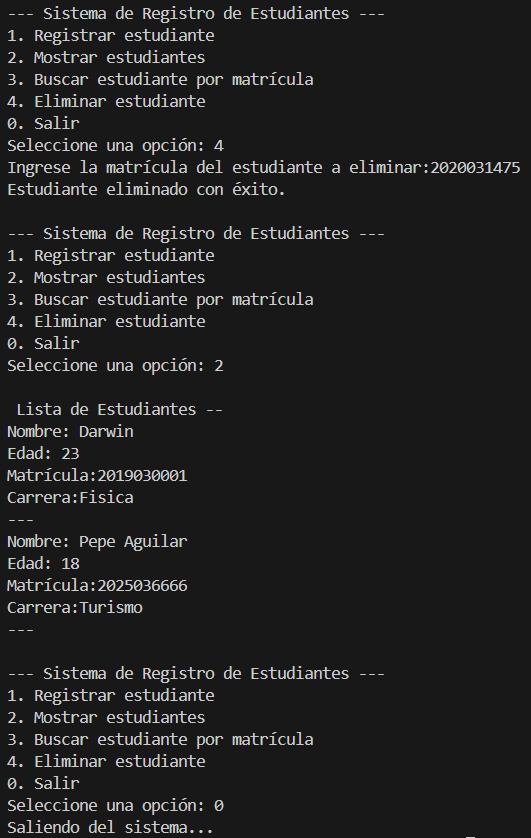

# SistemaRegistrosEstudiantes
### Descripción del Proyecto

Este proyecto es un sistema de registro de estudiantes desarrollado en Java. Permite gestionar una lista de estudiantes utilizando estructuras de control básicas y la clase Scanner para la entrada de datos. Además, se integra con GitHub para el control de versiones y la colaboración en equipo.

### Funcionalidades:
- Registrar nuevos estudiantes con su nombre, edad, matrícula y carrera.
- Mostrar la lista de estudiantes registrados.
- Buscar un estudiante por matrícula.
- Eliminar un estudiante de la lista.
- Salir del programa.

### Instrucciones para Compilar y Ejecutar el Programa
Requisitos Previos:
1. Tener instalado Java Development Kit (JDK) 8 o superior.
2. Un IDE compatible con Java (IntelliJ IDEA, Eclipse, NetBeans) o terminal con javac.
3. Conocimientos básicos de Git y GitHub para la gestión del repositorio.

### Pasos para Compilar y Ejecutar:
1. Clonar el repositorio desde GitHub:
> git clone https://github.com/Nnncyyy/SistemaRegistrosEstudiantes.git

2. Acceder a la carpeta del proyecto:
> cd SistemaRegistroEsrtudiante

3. Compilar el código fuente:
> javac SistemaRegistroEsrtudiante.java

4. Ejecutar el programa:
> java SistemaRegistroEsrtudiante

### Capturas de Pantalla del Programa en Funcionamiento

  
gg
  
dd
  

### Enlace del Repositorio en GitHub
https://github.com/Nnncyyy/SistemaRegistrosEstudiantes.git

